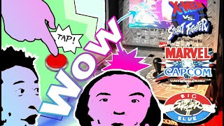

## *Arcade1Up Software Modding Resources*

1. XVS/MVC/Big Blue
2. Yoga Flame/Shinkuu Hadouken

# X-Men vs SF / Marvel vs Capcom / Big Blue / Yoga / Shinkuu

## Requirements for XVS Software Modding 1/2

### Google USB Driver
- [Visit Download Page](https://developer.android.com/studio/run/win-usb)

### Android SDK Platform Tools
- [Visit Download Page](https://developer.android.com/studio/releases/platform-tools)

### The Contents of this Repo
- [Quick-Download Link](https://github.com/thecodealwayswins/xvs-mvc-bb-a1up/archive/refs/heads/main.zip)

## Tutorials

### [**Soft Modding Part 1** Getting Started, Considerations, Accessing the OS Menu](https://www.youtube.com/watch?v=TldfdO_AGUI)

### [**Soft Modding Part 2**: Connecting to a PC, Sideloading Apps, Micro USB to HDMI @ 1080p/60](https://youtu.be/I9OJyUnSFI)

### [**Big Blue Final Burn Delta Input Drivers**: Arcade 1Up INPUT LAG FIXed (Big Blue, MVC, MVC2)](./doc/img/a1up-software-mods-bb-drivers.png)](https://youtu.be/D8wf_7tr9pU)

Note: installing the above in Xmen v SF/MVC/BB will remove the need for a 5-second wait (not covered in vids) on your PC. But beyond that no need for XVS/MVC input drivers since these come with the cab thanks to Arcade1Up working with myself and the community.

### [**Shinkuu/Yoga Final Burn Delta Drivers**: Arcade 1Up INPUT LAG FIXed (Big Blue, MVC, MVC2)](https://youtu.be/D8wf_7tr9pU)

*Note: installing the above in Xmen v SF/MVC/BB will remove the need for a 5-second wait (not covered in vids) on your PC. But beyond that no need for XVS/MVC input drivers since these come with the cab thanks to Arcade1Up working with myself and the community.*
