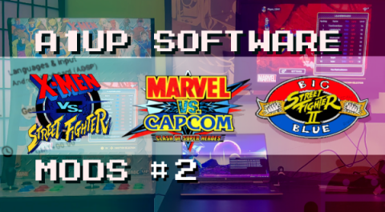
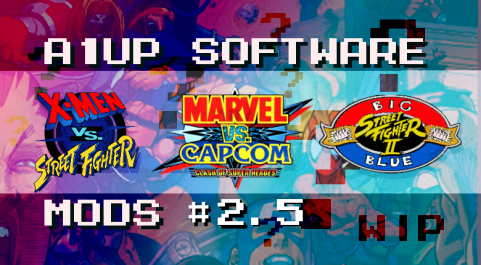

## *Arcade1Up Software Modding Resources*
# X-Men vs SF / Marvel vs Capcom / Big Blue

## Requirements

### Google USB Driver
- [Visit Download Page](https://developer.android.com/studio/run/win-usb)

### Android SDK Platform Tools
- [Visit Download Page](https://developer.android.com/studio/releases/platform-tools)

### The Contents of this Repo
- [Quick-Download Link](https://github.com/thecodealwayswins/xvs-mvc-bb-a1up/archive/refs/heads/main.zip)

## Tutorials

### **Part 1** Getting Started, Considerations, Accessing the OS Menu

### **Part 2**: Connecting to a PC, Sideloading Apps, Micro USB to HDMI @ 1080p/60

### **Part 2.5**: Drag n Drop App Installation + More
*(Title/Script is not Final)*

